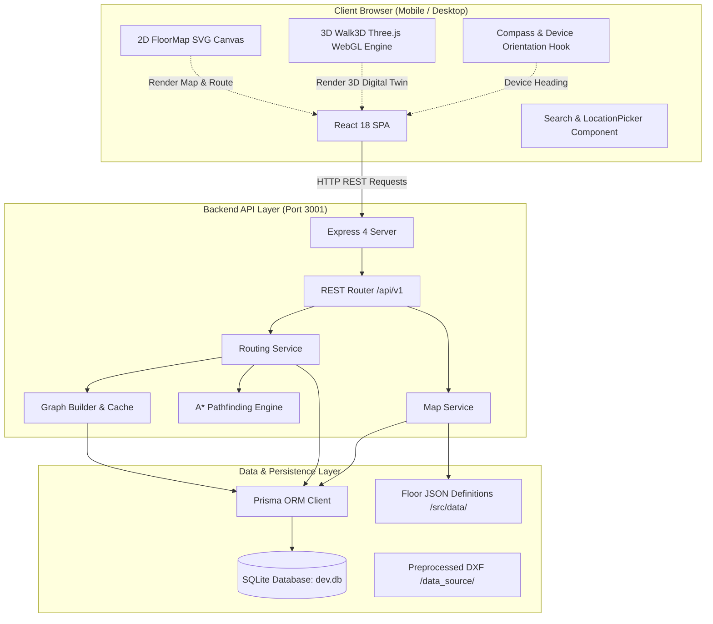
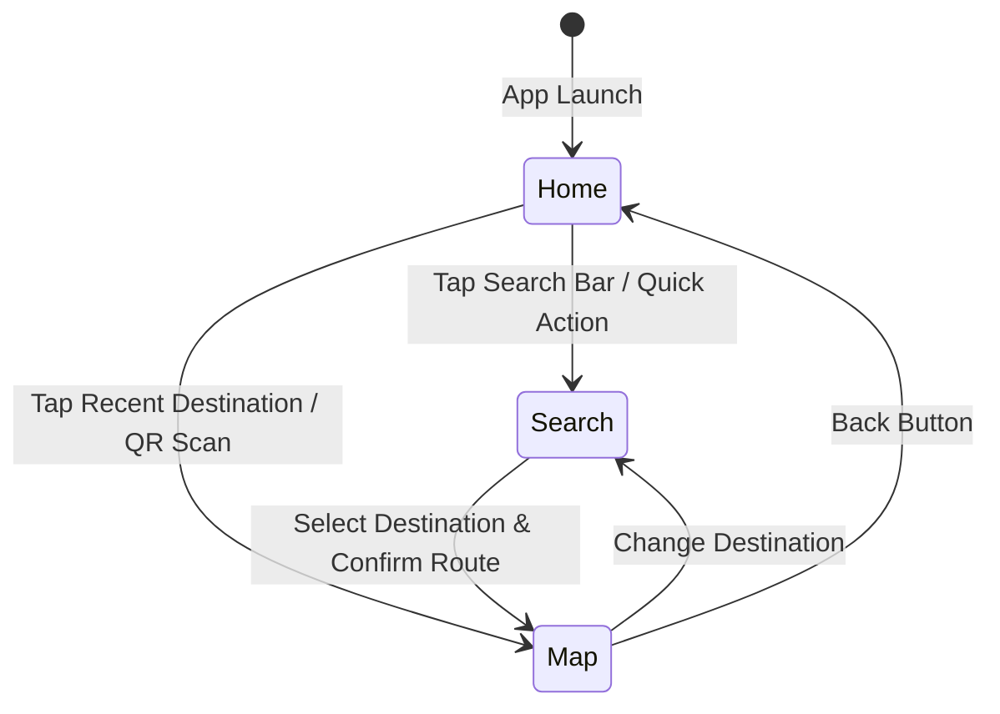
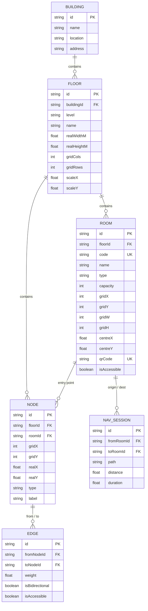
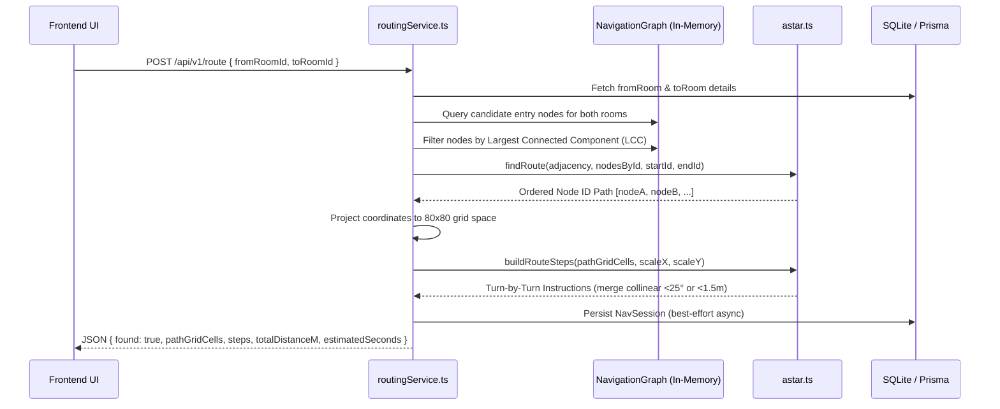
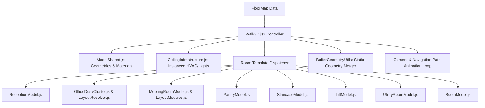

# Indoor Navigation System — Developer Handover & Knowledge Transfer

> **Project Handover Document**  
> **Target Audience:** Incoming Software Engineers & Technical Maintainers  
> **Authoritative Repository Version:** 1.0.0  
> **Last Validated:** August 2026

---

## Table of Contents

1. [Project Overview](#1-project-overview)
2. [System Architecture](#2-system-architecture)
3. [Repository Structure](#3-repository-structure)
4. [Frontend Architecture](#4-frontend-architecture)
5. [Backend Architecture](#5-backend-architecture)
6. [Database & Data Models](#6-database--data-models)
7. [Navigation & Routing Engine](#7-navigation--routing-engine)
8. [2D Map System](#8-2d-map-system)
9. [3D Walkthrough System](#9-3d-walkthrough-system)
10. [Building & Floor Onboarding Pipeline](#10-building--floor-onboarding-pipeline)
11. [Existing Buildings & Locations](#11-existing-buildings--locations)
12. [Data Files & Authoritative Sources](#12-data-files--authoritative-sources)
13. [Development Setup & Quickstart](#13-development-setup--quickstart)
14. [Production & Raspberry Pi Deployment](#14-production--raspberry-pi-deployment)
15. [Testing & Validation](#15-testing--validation)
16. [Common Maintenance Tasks](#16-common-maintenance-tasks)
17. [Known Issues & Important Gotchas](#17-known-issues--important-gotchas)
18. [Git & Version Control Workflow](#18-git--version-control-workflow)
19. [Environment Variables & Configuration](#19-environment-variables--configuration)
20. [Troubleshooting Guide](#20-troubleshooting-guide)
21. [Handover Verification Checklist](#21-handover-verification-checklist)

---

## 1. Project Overview

### 1.1 What the Application Does
The **Indoor Navigation System** is a mobile-first, browser-based indoor wayfinding and 3D digital-twin walkthrough application built for corporate office environments (specifically VWITS / Volkswagen Group Technology Solutions facilities across multiple campuses).

The system allows employees and visitors to:
- Select a physical campus location (**Pune**, **Bangalore**, **Gurugram**), building, and floor.
- Search for rooms, meeting spaces, executive cabins, cafeterias, restrooms, and emergency exits.
- Compute the shortest walkable indoor path between any two rooms or waypoints.
- View interactive 2D SVG floor plans with room boundaries, door pins, and animated route directions.
- Experience an immersive, first-person **3D Walkthrough** of the route rendered in real time using Three.js.
- Align with physical direction using a **Device Orientation Compass** on mobile devices.
- Scan physical **QR Code stickers** deployed across office locations to immediately establish a starting position.

### 1.2 The Problem It Solves
Large multi-building, multi-floor corporate offices are difficult to navigate for new employees, visiting clients, and facilities staff. Traditional GPS cannot penetrate indoor concrete buildings, and static PDF floor plans lack routing, live search, and directional awareness. This application provides real-time turn-by-turn guidance, spatial orientation, and visual landmarks without requiring native app installation.

### 1.3 Currently Supported Locations & Buildings

| Location (City) | Building | Building ID | Floors Onboarded | Floor IDs |
| :--- | :--- | :--- | :--- | :--- |
| **Pune** | **Hudson** | `building-hudson` | 5th Floor, 6th Floor, 7th Floor | `floor-hudson-f5`, `floor-hudson-f6`, `floor-hudson-f7` |
| **Pune** | **Ganges** | `building-ganges` | 9th Floor | `floor-ganges-f9` |
| **Bangalore** | **Jupiter** | `building-jupiter` | 1st Floor | `floor-jupiter-f1` |
| **Bangalore** | **Gravity** | `building-gravity` | 1st Floor | `floor-gravity-f1` |
| **Gurugram** | **Gurugram** | `building-gurugram` | 3rd Floor | `floor-gurugram-f3` |

### 1.4 Core Capabilities
- **Hierarchical Location Discovery:** 3-tier cascade selector (`Location (City) → Building → Floor`).
- **Interactive 2D Floor Maps:** Pure vector SVG rendering, smooth pan/pinch-to-zoom without blur, dynamic room coloring, door entry markers, and directional dashed route animation.
- **Categorized & Debounced Search:** Fast search by room name, code, or amenity category with live typeahead suggestions and origin confirmation sheet.
- **Graph-Based A\* Routing Engine:** High-performance in-memory pathfinding with automatic corridor edge splitting, largest connected component (LCC) candidate node selection, loop elimination, and turn-by-turn step instructions.
- **Real-Time 3D Digital Twin Walkthrough:** Procedural 3D scene generation (walls, glass partitions, executive desks, conference tables, ergonomic chairs, monitors, whiteboards, plants, pantry appliances, lift lobbies, utility racks, and instanced ceiling troffers/sprinklers) with camera animation, speed controls (1×/2×/4×), and pause/resume.
- **Device Orientation & Compass:** Live phone sensor integration (`DeviceOrientationEvent`, iOS `webkitCompassHeading`, Android `alpha`) with low-pass filtering, desktop fallback, cardinal heading enrichment, and click-to-reset orientation.
- **Physical QR Code Integration:** URL query parameter listener (`?qr=LOC-...`) that resolves room identity and sets the navigation starting point automatically.

---

## 2. System Architecture



### Layer Responsibilities

1. **Frontend Layer (`frontend/`):**
   - Single Page Application built with React 18 and Vite.
   - Manages navigation state (current location, destination, calculated route).
   - Renders 2D vector floor plans via SVG and 3D walkthroughs via Three.js.
   - Reads hardware orientation sensors and enriches turn-by-turn steps with cardinal directions.

2. **Backend API Layer (`backend/src/`):**
   - Express REST API with TypeScript.
   - Houses routing logic, graph caching, and map metadata retrieval.
   - Computes shortest paths between rooms on demand using A\* pathfinding.
   - Provides room search, QR code resolution, and floor geometry endpoints.

3. **Data & Persistence Layer (`backend/prisma/` & `backend/src/data/`):**
   - SQLite database managed via Prisma ORM for relational persistence (buildings, floors, rooms, nodes, edges, sessions).
   - Authoritative floor layout JSON definitions containing room boundaries, doors, and navigation graphs.

---

## 3. Repository Structure

```
Indoor_Navigation/
├── package.json                   # Root package runner (concurrently backend & frontend)
├── package-lock.json
│
├── backend/                       # Node.js Express + TypeScript Backend
│   ├── package.json
│   ├── tsconfig.json
│   ├── .env                       # Local environment variables (DATABASE_URL, PORT, etc.)
│   ├── .env.example
│   ├── prisma/
│   │   ├── schema.prisma          # Database schema (SQLite datasource)
│   │   ├── dev.db                 # Active SQLite database file
│   │   └── migrations/            # Prisma migration history
│   ├── src/
│   │   ├── index.ts               # Server entry point & graph cache initialization
│   │   ├── app.ts                 # Express configuration, security, CORS, & rate limiting
│   │   ├── types/
│   │   │   └── index.ts           # Shared TypeScript interfaces (GraphNode, RouteResult, etc.)
│   │   ├── api/
│   │   │   └── routes/
│   │   │       └── index.ts       # Express REST API endpoints (/route, /floors, /rooms, etc.)
│   │   ├── services/
│   │   │   ├── mapService.ts      # Floor map retrieval & layout coordinate projection
│   │   │   └── routingService.ts  # Route orchestration, candidate selection, & graph caching
│   │   ├── engine/
│   │   │   ├── astar.ts           # Pure A* engine (graph & grid pathfinding) + step builder
│   │   │   └── graphBuilder.ts    # In-memory graph builder, inline edge splitter, & LCC analysis
│   │   │   └── gridGenerator.ts   # Rasterizer for DXF walls to walkability grid
│   │   ├── utils/
│   │   │   └── projection.ts      # Dynamic bounding box & layout projection utilities
│   │   └── data/                  # Authoritative layout JSONs, clean JSONs, and nav graphs
│   │       ├── Hudson_5th.json
│   │       ├── Hudson_6th_Floor.json
│   │       ├── Hudson_7th.json
│   │       ├── Ganges_9th.json
│   │       ├── Jupiter.json
│   │       ├── Gravity.json
│   │       └── Gurugram_3rd.json
│   ├── data_source/               # Raw CAD files (.dwg, .dxf) and cleaned DXFs
│   ├── scripts/                   # CLI tools for CAD parsing, cleaning, importing, and testing
│   │   ├── seed_all.ts            # Master database setup & seeding script across all campuses
│   │   ├── importEditorFloorDefinition.ts # Core JSON layout importer & graph edge splitter
│   │   ├── parse_dxf.py           # DXF extractor (walls, rooms, labels, bounding box)
│   │   ├── clean_ganges_dxf.py    # Custom layer stripper for Ganges 9th Floor DXF
│   │   ├── clean_jupiter_dxf.py   # Custom layer stripper for Jupiter Bangalore DXF
│   │   ├── build_nav_data.py      # Grid generator and wall obstacle dilator
│   │   ├── build_nav_graph.py     # All-pairs corridor path simplifier & graph builder
│   │   ├── validate_location_hierarchy.ts # Cross-campus integrity & route validation
│   │   └── validate_jupiter_onboarding.ts # Detailed statistical & topological test script
│   └── scratch/                   # Developer diagnosis and audit scripts
│
└── frontend/                      # React 18 + Vite SPA Frontend
    ├── package.json
    ├── vite.config.js             # Vite configuration with tunnel host allowances & proxy
    ├── index.html                 # HTML entry point with mobile viewport settings
    ├── .env                       # Frontend environment variables (VITE_API_BASE)
    ├── .env.example
    └── src/
        ├── Main.jsx               # React DOM root mounting
        ├── app.jsx                # Root application controller, routing, & QR handler
        ├── app.css                # Global styles, mobile reset, & shell container
        ├── Pages/
        │   ├── Home.jsx           # Landing screen (hero, location picker, quick actions, recents)
        │   ├── Search.jsx         # Search destination screen (categories, typeahead, confirm sheet)
        │   └── MapView.jsx        # Dual-mode viewer (2D FloorMap & 3D Walk3D toggle + route sheet)
        ├── components/
        │   ├── FloorMap.jsx       # 2D interactive SVG map with zoom/pan & graph debugger
        │   ├── Walk3D.jsx         # 3D First-person walkthrough Three.js canvas
        │   ├── LocationPicker.jsx # 3-tier cascade selector (Location · Building · Floor)
        │   ├── Compass.jsx        # Google Maps-style orientation indicator button
        │   ├── TopBar.jsx         # Header bar with back navigation & route details
        │   ├── BottomNav.jsx      # Mobile navigation tab bar
        │   ├── StatusBar.jsx      # Diagnostic status header
        │   ├── layouts/           # 3D procedural layout generators
        │   │   ├── LayoutResolver.js
        │   │   ├── LayoutModules.js
        │   │   ├── FurnitureLayoutGenerator.js
        │   │   └── FurnitureModels.js
        │   └── models/            # 3D room & furniture geometry templates
        │       ├── ModelShared.js
        │       ├── MeetingRoomModel.js
        │       ├── OfficeDeskCluster.js
        │       ├── ReceptionModel.js
        │       ├── PantryModel.js
        │       ├── StaircaseModel.js
        │       ├── LiftModel.js
        │       ├── UtilityRoomModel.js
        │       ├── BoothModel.js
        │       └── CeilingInfrastructure.js
        ├── hooks/
        │   ├── useDeviceOrientation.js # Mobile sensor hook (iOS/Android/fallback)
        │   └── useDeadReckoning.js     # Step counter & PDR position tracker
        ├── utils/
        │   └── orientationUtils.js     # Bearing math & cardinal instruction enrichment
        ├── api/
        │   └── routes.js          # Client fetch helpers
        └── data/
            └── locations.js       # Static reference metadata
```

### Directory Criticality Matrix

| Directory / File | Type | Runtime Critical? | Development / Onboarding Only? | Modification Likelihood |
| :--- | :--- | :--- | :--- | :--- |
| `backend/src/api/routes/` | Backend REST API | **Yes** | No | Low (add new endpoints) |
| `backend/src/services/` | Business Logic & Projection | **Yes** | No | Medium (when registering floors) |
| `backend/src/engine/` | A\* Routing & Graph Engine | **Yes** | No | Low (core algorithmic engine) |
| `backend/src/data/` | Floor Layout JSONs | **Yes** | Yes (seeded into DB) | High (when editing layouts) |
| `backend/prisma/` | Schema & SQLite DB | **Yes** | No | High (when changing entities/seeding) |
| `backend/scripts/` | Data Importers & Validators | No | **Yes** | High (when onboarding new floors) |
| `backend/data_source/` | Raw CAD / DXF Files | No | **Yes** | High (source files for onboarding) |
| `frontend/src/app.jsx` | Main State Controller | **Yes** | No | Medium |
| `frontend/src/Pages/` | UI Screens | **Yes** | No | Medium |
| `frontend/src/components/FloorMap.jsx` | 2D SVG Map Renderer | **Yes** | No | Medium |
| `frontend/src/components/Walk3D.jsx` | 3D WebGL Renderer | **Yes** | No | High (when tuning 3D aesthetics) |
| `frontend/src/components/models/` | 3D Geometry Templates | **Yes** | No | High (when adding 3D room types) |
| `frontend/src/hooks/` | Device Orientation Hooks | **Yes** | No | Low |

---

## 4. Frontend Architecture

### 4.1 React State & Navigation Lifecycle (`frontend/src/app.jsx`)
`app.jsx` manages the central application state:
- **`selectedLocation`**, **`selectedBuildingId`**, **`selectedFloorId`**: 3-tier hierarchy persisted in browser `localStorage`.
- **`userLocation`**: Current starting point (Room object). Defaults to the selected floor's Reception or first room.
- **`destination`**: Target destination (Room object).
- **`route`**: The calculated route payload returned by `POST /api/v1/route`.
- **`page`**: Active view (`"home"`, `"search"`, `"map"`, `"qr"`).



### 4.2 Main Pages
1. **Home (`Pages/Home.jsx`):**
   - Displays current location hero card with inline `LocationPicker`.
   - Search bar trigger leading to Search page.
   - Quick Action cards (Cafeteria, Restrooms, Reception, Emergency exit).
   - Recent destinations loaded from `localStorage` (`indoorNav.recentDestinations`).
2. **Search (`Pages/Search.jsx`):**
   - Filter chips by category (`Meeting`, `Workspace`, `Facilities`, `Food`, `Services`).
   - Live debounced text search (300ms) hitting `GET /api/v1/rooms/search`.
   - Route confirmation bottom sheet allowing users to customize or search the starting location with arrow-key autocomplete before launching navigation.
3. **MapView (`Pages/MapView.jsx`):**
   - Houses the toggle between **2D Vector Map** (`FloorMap.jsx`) and **3D Walkthrough** (`Walk3D.jsx`).
   - Displays the floating Google Maps-style `Compass` widget.
   - Draggable bottom sheet with route statistics (total distance, floor changes) and natural language turn-by-turn steps.

### 4.3 Key Components
- **`LocationPicker.jsx`:** Renders the 3-tier cascade selector (`Location (City) ▼ · Building ▼ · Floor ▼`). Changing the city automatically selects the first building in that city; changing the building fetches its floors and resets routing states.
- **`Compass.jsx`:** Minimalist floating navigation control. Features a rotating paper-plane pointer, red North reference tick, sensor-active indicator dot, and click-to-reset orientation handler.
- **`TopBar.jsx` & `BottomNav.jsx`:** Global header and footer navigation tabs.

---

## 5. Backend Architecture

### 5.1 Express Server Configuration (`backend/src/app.ts`)
- **Security:** `helmet()` security headers and `cors()` supporting configurable allowed origins (including Cloudflare Tunnel and ngrok URLs).
- **Optimization:** `compression()` for Gzip responses.
- **Rate Limiting:** 200 requests per minute per IP via `express-rate-limit`.
- **Pre-Caching:** Pre-builds the in-memory navigation graph cache on startup via `buildGraphCache(prisma)` in `backend/src/index.ts`.

### 5.2 Complete REST API Reference

| Method | Endpoint | Query / Body Params | Response Description |
| :--- | :--- | :--- | :--- |
| `GET` | `/api/v1/health` | None | Returns `{ status: "ok", version: "1.0.0" }`. |
| `GET` | `/api/v1/buildings` | None | Lists all buildings with floor counts. |
| `GET` | `/api/v1/buildings/:buildingId/floors` | `buildingId` | Lists all floors for a building with room counts. |
| `GET` | `/api/v1/floors/:floorId/map` | `floorId` | Primary map endpoint: returns floor metadata, rooms, nodes, edges, and walkability grid. |
| `GET` | `/api/v1/floors/:floorId/geometry` | `floorId` | Returns raw DXF wall geometry and bounding box from JSON. |
| `GET` | `/api/v1/rooms/search` | `?q=...&floorId=...&type=...` | Searches rooms by name, code, or QR code. Optional floor and category filters. |
| `GET` | `/api/v1/rooms/:roomId` | `roomId` | Returns single room details with building/floor metadata. |
| `GET` | `/api/v1/rooms/qr/:qrCode` | `qrCode` | Resolves a physical QR code string to its associated room entity. |
| `POST` | `/api/v1/route` | Body: `{ fromRoomId, toRoomId, options? }` | Computes shortest path between rooms using graph A\*. Returns nodes, grid cells, and natural turn-by-turn steps. |
| `GET` | `/api/v1/route/qr` | `?from=LOC-A&to=LOC-B&accessible=false` | Convenience endpoint computing route directly between two QR codes. |
| `POST` | `/api/v1/layouts/publish` | Body: `{ building, floor, definition, options? }` | Publishes Layout Editor definition (rooms, paths, graph) atomically into DB; splits inline edges; creates synthetic door nodes; invalidates routing cache. |

---

## 6. Database & Data Models

### 6.1 Database Engine
- **Technology:** SQLite (via `@prisma/client` and `prisma`).
- **File Location:** `backend/prisma/dev.db`.
- *Note on Architecture History:* The project initially outlined PostgreSQL in early MVP drafts, but was migrated to SQLite for standalone portability, zero-configuration local execution, and Raspberry Pi embedded deployment.

### 6.2 Entity Relationship Diagram



### 6.3 Seeding and Maintenance
The database is **fully reproducible from source JSON definitions**.
- Run `npm --prefix backend run db:setup` to execute:
  1. `npx prisma db push --skip-generate` (creates schema tables in `dev.db`).
  2. `ts-node scripts/seed_all.ts` (imports all campus floor layouts from `backend/src/data/` via `importEditorFloorDefinition.ts`).

---

## 7. Navigation & Routing Engine

### 7.1 Pathfinding Architecture (`backend/src/engine/astar.ts`)
The routing engine provides two pathfinding implementations:
1. **Graph A\* (`findRoute`):** Used at runtime. Traverses the pre-computed navigation graph nodes and edges. Employs Euclidean distance heuristics, `cameFrom` maps, and loop-collapse logic (removes `A → B → A` backtracks).
2. **Grid A\* (`astarGrid`):** 4-directional Manhattan pathfinder used by preprocessing scripts (`build_nav_graph.py`) to rasterize open corridors and discover junction nodes.

### 7.2 End-to-End Route Execution Flow



### 7.3 Advanced Routing Features
- **Inline Edge Splitting (`splitInlineEdges` in `graphBuilder.ts`):** Automatically detects if an edge between two distant corridor nodes bypasses intermediate junction or door nodes (within 1.5 grid units / ~1m). It subdivides the edge into sequential segments, preventing route cuts across rooms.
- **Candidate Entry Selection & LCC Prioritization (`getRoomCandidates` in `routingService.ts`):** Identifies all entry nodes associated with a room, filters out disconnected zero-adjacency nodes, and prioritizes nodes belonging to the graph's Largest Connected Component.
- **Natural Language Step Generation (`buildRouteSteps` in `astar.ts`):** Calculates vector bearings between consecutive path segments, merges micro-zigzags, and assigns turn instructions based on strict angle thresholds:
  - `0° – 20°`: "Continue straight"
  - `20° – 60°`: "Bear slight left / right"
  - `60° – 120°`: "Turn left / right"
  - `> 120°`: "Turn around"

---

## 8. 2D Map System

### 8.1 Vector SVG Rendering (`frontend/src/components/FloorMap.jsx`)
- **No-Blur Canvas:** Operates directly on the SVG `viewBox` coordinate space (`0 0 480 480`), ensuring lines, text, and polygons remain razor-sharp at all zoom levels (unlike CSS scale transforms).
- **Coordinate Projection:** Normalizes CAD millimeter coordinates or raw editor coordinates into the standard 80×80 grid space. Flips the Y-axis so the map displays with user orientation forward (bottom-to-top).
- **Room Polygon Rendering:** Renders exact multi-point SVG `<polygon>` shapes, door entry dots, and background cards with soft drop shadows (`#card-shadow`).
- **Color Coding by Room Type:**
  - Meeting Rooms / Cabins: Green (`#E8F5E0` fill, `#A8CC85` stroke, `#27500A` text)
  - Reception: Blue (`#E0EEFB` fill, `#86B6E6` stroke, `#0C447C` text)
  - Pantry / Cafeteria: Orange (`#FBEDD4` fill, `#E8B772` stroke, `#7A4413` text)
  - Lifts / Exits / Restrooms / Utilities: Distinct accessible pastels.
- **Directional Animated Path:** Layered glowing polyline with SVG `stroke-dashoffset` animation and directional chevrons (`#route-arrow`).
- **Interactive Graph Debugger:** Integrated developer overlay in `FloorMap.jsx` allowing real-time inspection of route segments, node IDs, and test deletion of graph edges directly from the UI.

---

## 9. 3D Walkthrough System

### 9.1 Three.js Digital Twin Architecture (`frontend/src/components/Walk3D.jsx`)
`Walk3D.jsx` generates a full 3D interactive model of the selected floor directly from the room polygon definitions and path coordinates.



### 9.2 Procedural Room & Furniture Templates
- **Reception:** Curved wooden front desk, corporate feature wall with VWITS logo accent, guest sofa units, low coffee tables, and indoor potted plants.
- **Open Workspace:** Clusters of 2×2 / 2×3 ergonomic modular workstations, privacy dividers, dual monitors with screen glow, executive task chairs, and shared printer stations.
- **Meeting Rooms & Boardrooms:** Glass corridor walls, central wooden conference tables, drum bases, executive seating, wall-mounted 4K displays, whiteboards, and presentation pods.
- **Executive Cabins:** Executive L-desks, high-back leather chairs, guest visitor chairs, and full-height glass entrances for designated offices (e.g., *Head Cabins, CISO, Algorithm, Power BI, Artifact, Concept, Zero Distance*).
- **Pantry & Cafeteria:** Solid quartz counters, kitchen sinks, microwaves, commercial coffee machines, tall bar stools, and round dining tables.
- **Lifts & Staircases:** Brushed stainless steel elevator doors, call button indicators, floor number signage, concrete stair steps, and safety railings.
- **Ceiling Infrastructure (`CeilingInfrastructure.js`):** Instanced 2×4 recessed LED troffers, directional downlights, HVAC diffusers, and fire suppression sprinklers.

### 9.3 Performance Optimizations & Floor-Specific Logic
- **Static Geometry Merging (`BufferGeometryUtils.mergeGeometries`):** On large complex floors (e.g., Ganges 9th Floor, Jupiter, Gravity, Gurugram), meshes sharing materials are automatically merged into unified buffer geometries on initial load, reducing WebGL draw calls from >1,500 to <50 for smooth 60 FPS mobile performance.
- **Path Animation & Slerp:** Camera smoothly follows the spline path at eye level (1.75m), performing spherical linear interpolation on yaw rotation to eliminate jitter when navigating corridor corners.

---

## 10. Building & Floor Onboarding Pipeline

This section documents the step-by-step pipeline required to onboard a new CAD floor plan into the system.

```mermaid
graph LR
    DWG[1. DWG Source] -->|ODA Converter| DXF[2. DXF R2000]
    DXF -->|clean_*_dxf.py| CLEAN_DXF[3. Cleaned DXF]
    CLEAN_DXF -->|parse_dxf.py| FLOOR_JSON[4. floor_data.json]
    FLOOR_JSON -->|build_nav_data.py| NAV_DATA[5. nav_floor_data.json]
    NAV_DATA -->|build_nav_graph.py| GRAPH[6. Nav Graph Added]
    GRAPH -->|Layout Editor / Manual| FINAL_JSON[7. Authoritative Floor JSON]
    FINAL_JSON -->|importEditorFloorDefinition.ts| DB[(8. SQLite Database)]
```



### Step 1: CAD Source Acquisition & Conversion
1. Place raw `.dwg` file in `backend/data_source/`.
2. Convert `.dwg` to **DXF R2000 / R2004** using the free **ODA File Converter** (`opendesign.com/guestfiles/oda_file_converter`). *Do not use DXF R2018.*

### Step 2: Layer Cleaning & Preprocessing
CAD files frequently contain tens of thousands of electrical, HVAC, and dimension entities. Run a cleaner script to isolate structural walls and room text:
- For Ganges: `python backend/scripts/clean_ganges_dxf.py --input "backend/data_source/Ganges.dxf" --output "backend/data_source/Ganges_Clean.dxf"`
- For Jupiter: `python backend/scripts/clean_jupiter_dxf.py --input "backend/data_source/Jupiter.dxf" --output "backend/data_source/Jupiter_Clean.dxf"`
- For Generic Floor Plans: `python backend/scripts/clean_floor_data.py --input raw.json --output clean.json`

### Step 3: DXF Parsing
Extract wall lines, text tags, and bounding boxes into JSON:
```bash
python backend/scripts/parse_dxf.py --input backend/data_source/Your_Clean.dxf --output backend/src/data/floor_data.json
```

### Step 4: Rasterization & Walkability Grid Generation
Convert wall lines into an 80×80 walkability grid with obstacle dilation:
```bash
python backend/scripts/build_nav_data.py --input backend/src/data/floor_data.json --output backend/src/data/nav_your_floor.json --floor-id floor-xyz-f1 --building "Building Name" --level 1
```

### Step 5: Navigation Graph Generation
Generate all-pairs shortest paths and extract corridor corner nodes:
```bash
python backend/scripts/build_nav_graph.py --input backend/src/data/nav_your_floor.json
```

### Step 6: Layout Definition & Database Registration
1. Ensure the authoritative layout JSON (`backend/src/data/Your_Building.json`) contains room polygons, doors, and graph nodes.
2. Register the floor in `backend/scripts/seed_all.ts` inside the `editorImports` array:
   ```ts
   {
     file: path.join(dataDir, 'Your_Building.json'),
     buildingId: 'building-your-building',
     buildingName: 'Your Building Name',
     location: 'Pune', // or 'Bangalore' / 'Gurugram'
     floorId: 'floor-your-floor-f1',
     level: '1',
     floorName: '1st Floor',
     qrPrefix: 'LOC-F1',
   }
   ```
3. Register the layout in `backend/src/services/mapService.ts` (`FLOOR_DATA_MAP` and `HUDSON_LAYOUT_FLOORS`) and `backend/src/utils/projection.ts` (`HUDSON_LAYOUT_FILES`).
4. Execute master seeding:
   ```bash
   npm --prefix backend run db:setup
   ```

---

## 11. Existing Buildings & Locations

### 1. Pune — Hudson Building (`building-hudson`)
- **Floors:** 5th Floor (`floor-hudson-f5`), 6th Floor (`floor-hudson-f6`), 7th Floor (`floor-hudson-f7`).
- **Data Files:** `Hudson_5th.json`, `Hudson_6th_Floor.json`, `Hudson_7th.json`.
- **Dimensions:** 73.58m × 47.61m.
- **Special Characteristics:** Standard CAD layer naming (`AR_01_WALL`, `SW-PARTITION GYPSUM`). Floor 6 & 7 contain specialized labs (*AI/VR Lab, Big Data Lab, GUI Lab, Adaptive Lab*) and executive cabins with full-height glass entrances.

### 2. Pune — Ganges Building (`building-ganges`)
- **Floors:** 9th Floor (`floor-ganges-f9`).
- **Data Files:** `Ganges_9th.json`, `floor_ganges_9th_clean.json`.
- **Dimensions:** 88.45m × 42.10m.
- **Custom Preprocessing:** Layer cleaner `clean_ganges_dxf.py` isolates `FL-LEGED TEXT` for room labels. Static geometry merging enabled in 3D walkthrough to handle large floor plate.

### 3. Bangalore — Jupiter Building (`building-jupiter`)
- **Floors:** 1st Floor (`floor-jupiter-f1`).
- **Data Files:** `Jupiter.json`, `floor_jupiter_clean.json`.
- **Dimensions:** Calibrated real dimensions: **72.025m × 36.200m** (`scaleX: 0.9003`, `scaleY: 0.4525`).
- **Custom Preprocessing:** Cleaner `clean_jupiter_dxf.py` strips complex interior decoration and gym equipment blocks while retaining `ROOM TEXT` and `PASSAGE LINEOUT`.

### 4. Bangalore — Gravity Building (`building-gravity`)
- **Floors:** 1st Floor (`floor-gravity-f1`).
- **Data Files:** `Gravity.json`.
- **Dimensions:** Calibrated real dimensions: **60.030m × 32.870m** (`scaleX: 0.7504`, `scaleY: 0.4109`).

### 5. Gurugram — Gurugram Building (`building-gurugram`)
- **Floors:** 3rd Floor (`floor-gurugram-f3`).
- **Data Files:** `Gurugram_3rd.json`.
- **Dimensions:** Calibrated real dimensions: **72.576m × 43.758m** (`scaleX: 0.9072`, `scaleY: 0.5470`).

---

## 12. Data Files & Authoritative Sources

| File Path | Description | Authoritative? | Manual Editing Allowed? |
| :--- | :--- | :--- | :--- |
| `backend/src/data/Hudson_5th.json` | 5th Floor Layout (Rooms, Polygons, Graph) | **Yes** | **Yes** (Source layout) |
| `backend/src/data/Hudson_6th_Floor.json` | 6th Floor Layout (Rooms, Polygons, Graph) | **Yes** | **Yes** (Source layout) |
| `backend/src/data/Hudson_7th.json` | 7th Floor Layout (Rooms, Polygons, Graph) | **Yes** | **Yes** (Source layout) |
| `backend/src/data/Ganges_9th.json` | Ganges 9th Floor Layout Definition | **Yes** | **Yes** (Source layout) |
| `backend/src/data/Jupiter.json` | Jupiter Bangalore 1st Floor Layout | **Yes** | **Yes** (Source layout) |
| `backend/src/data/Gravity.json` | Gravity Bangalore 1st Floor Layout | **Yes** | **Yes** (Source layout) |
| `backend/src/data/Gurugram_3rd.json` | Gurugram 3rd Floor Layout Definition | **Yes** | **Yes** (Source layout) |
| `backend/src/data/nav_*.json` | Pre-computed raster walkability grids | No | **No** (Generated by scripts) |
| `backend/src/data/floor_*_clean.json` | Cleaned intermediate DXF geometry | No | **No** (Generated by scripts) |
| `backend/prisma/dev.db` | Active SQLite Database File | No | **No** (Rebuilt via `seed_all.ts`) |

> [!WARNING]
> Never manually edit `backend/prisma/dev.db` using external SQLite GUI tools while the backend server is running, as this can cause file lock errors. Modify the JSON source files in `backend/src/data/` and re-run `npm --prefix backend run db:setup`.

---

## 13. Development Setup & Quickstart

### 13.1 Prerequisites
- **Node.js:** v18.0.0 or higher (v20+ recommended).
- **npm:** v9.0.0 or higher.
- **Python:** v3.10+ (required only if running CAD/DXF onboarding scripts; requires `pip install ezdxf`).

### 13.2 Installation & Startup Commands

```bash
# 1. Clone repository and navigate to root
git clone <repo-url>
cd Indoor_Navigation

# 2. Install dependencies for root, backend, and frontend
npm install
npm --prefix backend install
npm --prefix frontend install

# 3. Configure backend environment
# Ensure backend/.env exists with DATABASE_URL="file:./dev.db"
# (See Section 19 for full environment variable details)

# 4. Initialize SQLite database & seed all campus layouts
npm --prefix backend run db:setup

# 5. Start both Backend and Frontend concurrently in development mode
npm run dev
```

### 13.3 Local Access Endpoints
- **Frontend Web UI:** `http://localhost:5174` (or `http://localhost:5173`)
- **Backend REST API:** `http://localhost:3001/api/v1`
- **Backend Health Check:** `http://localhost:3001/api/v1/health`

---

## 14. Production & Raspberry Pi Deployment

### 14.1 Planned Architecture for Standalone Office Deployment
The intended on-premise production deployment targets a standalone **Raspberry Pi 4 / 5** or local mini-server connected to a dedicated office Wi-Fi SSID (`VWITS-IndoorNav`):

```
User Mobile Device (Connected to Office SSID)
        │
        ▼ (HTTP :80 / HTTPS :443)
Raspberry Pi / Linux Server
        │
        ├── Nginx (Reverse Proxy & Static Web Server)
        │     │
        │     ├── Serves React Static Production Build (/var/www/html)
        │     │
        │     └── Proxies /api/v1/ ──► Node.js / Express Server (:3001)
        │                                  │
        │                                  └── SQLite Database (dev.db)
```

### 14.2 Production Build Commands

```bash
# 1. Build Backend TypeScript into JavaScript (dist/index.js)
npm --prefix backend run build

# 2. Build Frontend React into Optimized Static Bundle (frontend/dist/)
npm --prefix frontend run build

# 3. Test Production Server locally
npm --prefix backend run start
```

### 14.3 Nginx Configuration Template (`/etc/nginx/sites-available/indoor-nav`)
```nginx
server {
    listen 80;
    server_name indoor-nav.local;

    # Serve React Static Build
    location / {
        root /home/pi/Indoor_Navigation/frontend/dist;
        index index.html;
        try_files $uri $uri/ /index.html;
    }

    # Proxy API Requests to Express
    location /api/v1/ {
        proxy_pass http://127.0.0.1:3001/api/v1/;
        proxy_http_version 1.1;
        proxy_set_header Upgrade $http_upgrade;
        proxy_set_header Connection 'upgrade';
        proxy_set_header Host $host;
        proxy_cache_bypass $http_upgrade;
    }
}
```

---

## 15. Testing & Validation

### 15.1 Automated Validation Scripts
The repository includes dedicated verification scripts to validate database topology, cross-campus routing, and data integrity:

```bash
# 1. Validate complete Location -> Building -> Floor hierarchy & route calculations
npx ts-node backend/scripts/validate_location_hierarchy.ts

# 2. Validate Jupiter Bangalore statistical integrity, components, and reachability
npx ts-node backend/scripts/validate_jupiter_onboarding.ts

# 3. Test API connectivity for Gravity & Jupiter endpoints
npx ts-node backend/scripts/test_gravity_api.ts
npx ts-node backend/scripts/test_jupiter_api.ts
```

### 15.2 Quality Assurance Checklist for New Floors
Whenever a new floor is onboarded, verify the following:
1. **Connectivity Check:** Ensure all rooms have valid door entry nodes and connect to the Largest Connected Component (0 unreachable rooms).
2. **2D Map Rendering:** Verify wall boundaries, door dots, and room labels display without distortion or overlap in `FloorMap.jsx`.
3. **Route Validation:** Compute sample routes from Reception to corner rooms across the floor plate and verify that paths do not pass through walls.
4. **3D Walkthrough Inspection:** Confirm ceiling troffers, executive desks, and glass walls generate without visual artifacts.
5. **Mobile Device Test:** Check compass orientation on iOS (Safari) and Android (Chrome).

---

## 16. Common Maintenance Tasks

### Task 1: Updating a Room Name or Capacity
1. Open the authoritative layout JSON in `backend/src/data/` (e.g., `Hudson_5th.json`).
2. Locate the room by its `id` and update properties (`name`, `type`, `doors`, `polygon`).
3. Re-run master seeding: `npm --prefix backend run db:setup`.

### Task 2: Adding a New Furniture / 3D Asset
1. Add modular geometry definitions in `frontend/src/components/models/` or `frontend/src/components/layouts/FurnitureModels.js`.
2. Connect the asset in `frontend/src/components/Walk3D.jsx` inside the appropriate room template switch case.

### Task 3: Adjusting Floor Physical Dimensions / Scale
If routes report incorrect meter distances or walking times:
1. Calibrate real-world width and height in meters in `backend/scripts/seed_all.ts`:
   ```ts
   await prisma.$executeRawUnsafe(
     "UPDATE floors SET realWidthM = 75.0, realHeightM = 48.0, widthM = 75.0, heightM = 48.0, scaleX = 0.9375, scaleY = 0.6000 WHERE id = 'your-floor-id'"
   );
   ```
2. Re-run `npm --prefix backend run db:setup`.

---

## 17. Known Issues & Important Gotchas

> [!IMPORTANT]
> Keep the following architectural realities in mind when modifying the codebase:

1. **SQLite Database Concurrency:** SQLite is single-writer. In production, keep write operations minimal (the backend only writes best-effort `NavSession` logs; all routing queries are pure reads).
2. **Y-Axis Coordinate Inversion:** CAD software uses Cartesian coordinates ($Y$ points up). Standard 2D SVG grids and screen rendering use inverted coordinates ($Y$ points down). `projection.ts` and `FloorMap.jsx` intentionally invert $Y$ (`rows - normY * rows`) to align screen display with forward walking direction.
3. **CAD Layer Inconsistency Across Buildings:** Every building's CAD drafter used distinct layer naming conventions (`AR_01_WALL` vs `FL-LEGED` vs `PASSAGE LINEOUT`). Always inspect CAD layers using `python backend/scripts/parse_dxf.py` before writing a cleaning filter.
4. **Three.js Static Geometry Merging:** On large floor plans, WebGL draw calls can choke mobile browsers. Ensure that static non-animated meshes in `Walk3D.jsx` continue to be merged via `BufferGeometryUtils.mergeGeometries`.
5. **Synthetic Centroid Doors:** If a room definition in JSON has an empty `doors: []` array, `importEditorFloorDefinition.ts` automatically generates a synthetic door node at the room's polygon centroid and connects it to the nearest corridor node.

---

## 18. Git & Version Control Workflow

### Branching Strategy
- `main`: Production-ready, verified codebase.
- `develop`: Integration branch for new campus onboarding and feature development.
- `feature/*`: Dedicated branches for specific floor onboarding or UI enhancements.

### Files That Must Never Be Committed
- `backend/prisma/dev.db` & `backend/prisma/dev.db-journal` (Local SQLite database binaries).
- `*.dwg` files $>50\text{ MB}$ (Store raw CAD in secure company storage; commit only cleaned DXFs or JSONs).
- `.env` files containing local IP addresses or hostnames.

---

## 19. Environment Variables & Configuration

### Backend (`backend/.env`)

| Variable | Purpose | Required? | Example |
| :--- | :--- | :--- | :--- |
| `DATABASE_URL` | Prisma SQLite database connection string | **Yes** | `"file:./dev.db"` |
| `PORT` | Express server port | No (default: `3001`) | `3001` |
| `HOST` | Express binding interface | No (default: `0.0.0.0`) | `0.0.0.0` |
| `NODE_ENV` | Runtime environment | No (default: `development`) | `development` / `production` |
| `FRONTEND_URLS` | Comma-separated CORS allowed origins | No | `http://localhost:5174,http://localhost:5173` |

### Frontend (`frontend/.env`)

| Variable | Purpose | Required? | Example |
| :--- | :--- | :--- | :--- |
| `VITE_API_BASE` | Public API base URL called by browser | No (default: `/api/v1`) | `http://localhost:3001/api/v1` |

---

## 20. Troubleshooting Guide

| Symptom | Likely Cause | Where to Investigate | Recommended Fix |
| :--- | :--- | :--- | :--- |
| **Backend crashes on startup with `P1003: SQLite database not found`** | Database file was not initialized | `backend/prisma/` | Run `npm --prefix backend run db:setup`. |
| **Frontend shows "Loading map..." indefinitely** | Backend API is not running or CORS blocked | Browser Console / Network tab | Verify backend is alive at `http://localhost:3001/api/v1/health` and check `FRONTEND_URLS`. |
| **Route calculates but cuts diagonally across rooms** | Inline corridor nodes missing intermediate edges | `backend/src/engine/graphBuilder.ts` | Verify `splitInlineEdges` threshold (default 5.0 layout units). Re-run `db:setup`. |
| **3D Walkthrough displays black/blank canvas** | WebGL context lost or uncalibrated floor dimensions ($0\text{m}$) | `frontend/src/components/Walk3D.jsx` | Check console for Three.js errors; ensure `realWidthM` and `realHeightM` are $>0$ in DB. |
| **Compass heading does not rotate on iPhone** | iOS 13+ requires explicit user interaction for permission | `frontend/src/hooks/useDeviceOrientation.js` | Tap the "Enable Sensor" badge on the compass button to trigger `DeviceOrientationEvent.requestPermission()`. |
| **Search returns 0 results for known rooms** | Search is scoped to a different active floor | `frontend/src/Pages/Search.jsx` | Verify active floor selector in Search header matches the target room's floor. |
| **Mobile devices on LAN get "Blocked request" from Vite** | Vite `allowedHosts` rejecting external IP | `frontend/vite.config.js` | Ensure `server.host: true` and tunnel wildcards (`.trycloudflare.com`) are configured in Vite. |

---

## 21. Handover Verification Checklist

Use this checklist to confirm the local environment is fully operational:

- [ ] Repository cloned successfully.
- [ ] Dependencies installed in root, `backend/`, and `frontend/`.
- [ ] Database initialized and seeded via `npm --prefix backend run db:setup`.
- [ ] Automated validation passed: `npx ts-node backend/scripts/validate_location_hierarchy.ts`.
- [ ] Concurrently dev server launches cleanly (`npm run dev`).
- [ ] 2D Map renders for Pune (Hudson, Ganges), Bangalore (Jupiter, Gravity), and Gurugram.
- [ ] Route calculation works between Reception and any selected office room.
- [ ] 3D Walkthrough launches and camera navigates along path with furniture visible.
- [ ] Compass widget rotates and resets orientation on click.
- [ ] Search typeahead and category filters return matching rooms.
- [ ] Production build succeeds: `npm --prefix backend run build` & `npm --prefix frontend run build`.
