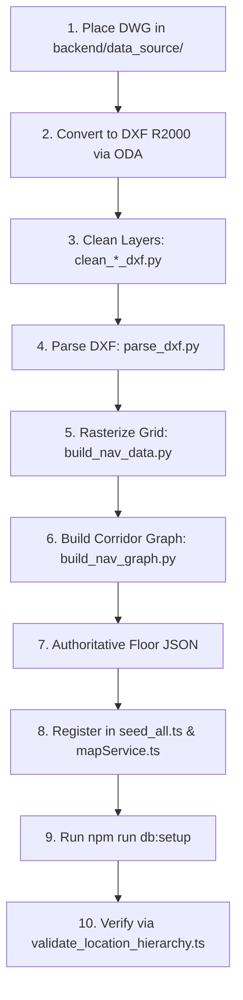

# Indoor Navigation — Standard Operating Procedure (SOP)

> **Document Type:** Operational Procedure & Maintenance Manual  
> **Complements:** `README.md` (High-Level Architecture & Technical Reference)  
> **Authoritative Target System:** Indoor Navigation Backend & Frontend Stack  
> **Last Updated:** September 2026

---

## Table of Contents

1. [Purpose](#1-purpose)
2. [Before You Start](#2-before-you-start)
3. [Start / Stop the Application](#3-start--stop-the-application)
4. [Environment & Configuration](#4-environment--configuration)
5. [Database Setup / Reset / Reseed](#5-database-setup--reset--reseed)
6. [Health Checks](#6-health-checks)
7. [Standard Testing Procedure](#7-standard-testing-procedure)
8. [Floor Onboarding Procedure](#8-floor-onboarding-procedure)
9. [Layout Editor Publication Procedure](#9-layout-editor-publication-procedure)
10. [Post-Publication Verification](#10-post-publication-verification)
11. [Updating Existing Floor Data](#11-updating-existing-floor-data)
12. [Routing Troubleshooting](#12-routing-troubleshooting)
13. [Map / 2D Troubleshooting](#13-map--2d-troubleshooting)
14. [3D Troubleshooting](#14-3d-troubleshooting)
15. [Database Recovery](#15-database-recovery)
16. [Production / Raspberry Pi Procedure](#16-production--raspberry-pi-procedure)
17. [Backup & Recovery](#17-backup--recovery)
18. [Known Operational Gotchas](#18-known-operational-gotchas)
19. [Documentation Discrepancies](#19-documentation-discrepancies)
20. [Final QA Checklist](#20-final-qa-checklist)
21. [Quick Reference](#21-quick-reference)

---

## 1. Purpose

This Standard Operating Procedure (SOP) provides step-by-step instructions for operating, maintaining, testing, troubleshooting, and onboarding data into the **Indoor Navigation System**.

### How This Document Relates to the README
- **`README.md` (or `README_Indoor_Navigation.md`):** Consult for high-level system architecture, component design, 2D/3D technical diagrams, database schemas, and background design choices.
- **This SOP:** Consult for exact terminal commands, execution directories, expected terminal outputs, diagnostic workflows, and emergency recovery procedures.

---

## 2. Before You Start

### 2.1 Tooling & Runtime Prerequisites

Verify that your workstation has the required runtimes installed before executing any scripts:

| Requirement | Minimum Version | Check Command | Successful Output Example |
| :--- | :--- | :--- | :--- |
| **Node.js** | v18.0.0+ (v20+ recommended) | `node -v` | `v20.11.1` |
| **npm** | v9.0.0+ | `npm -v` | `10.2.4` |
| **Python** | v3.10+ (for CAD/DXF tools) | `python --version` | `Python 3.11.5` |
| **ezdxf** | v1.1.0+ (Python CAD library) | `python -c "import ezdxf; print(ezdxf.__version__)"` | `1.1.0` |

*If `ezdxf` is missing:* Run `pip install ezdxf`.

### 2.2 Directory Navigation Convention
All paths in this SOP are given relative to the repository root directory:
```
Indoor_Navigation/
├── backend/
├── frontend/
└── docs/
```
Unless specified otherwise, commands prefixed with `npm --prefix backend` or `npm --prefix frontend` should be run directly from the workspace root (`Indoor_Navigation/`).

---

## 3. Start / Stop the Application

### 3.1 Starting the System in Development Mode

#### Option A: Start Full Stack Concurrently (Recommended)
Runs both Backend (port 3001) and Frontend (port 5174/5173) together:

```bash
# Directory: Indoor_Navigation/
npm run dev
```

**Expected Successful Output:**
```text
[backend] [RoutingService] Building navigation graph cache...
[backend] [RoutingService] Graph built: 1204 nodes, 1316 edges
[backend] Server listening on http://0.0.0.0:3001
[frontend]   VITE v5.4.0  ready in 320 ms
[frontend]   ➜  Local:   http://localhost:5174/
[frontend]   ➜  Network: http://192.168.1.50:5174/
```

#### Option B: Start Backend and Frontend Separately

**Terminal 1 (Backend):**
```bash
# Directory: Indoor_Navigation/backend/
npm run dev
```
*Expected Output:* `Server listening on http://0.0.0.0:3001`.

**Terminal 2 (Frontend):**
```bash
# Directory: Indoor_Navigation/frontend/
npm run dev
```
*Expected Output:* `Local: http://localhost:5174/`.

---

### 3.2 Stopping the System

- In any interactive terminal running `npm run dev`: Press `Ctrl + C`.

#### Killing Stuck or Orphaned Node Processes

If a port conflict occurs (`EADDRINUSE: 3001` or `5174`):

**On Windows (PowerShell):**
```powershell
# Identify process holding port 3001
netstat -ano | findstr :3001
# Kill all node processes
Stop-Process -Name node -Force
```

**On Linux / macOS / Raspberry Pi:**
```bash
# Terminate processes on port 3001 and 5174
fuser -k 3001/tcp
fuser -k 5174/tcp
# Or kill all node processes
pkill -f node
```

---

## 4. Environment & Configuration

### 4.1 Backend Environment (`backend/.env`)

Ensure `backend/.env` exists. If missing, copy from `backend/.env.example`:

```bash
# Directory: Indoor_Navigation/backend/
cp .env.example .env
```

**Required Configuration:**
```ini
# SQLite database path (relative to backend/prisma/)
DATABASE_URL="file:./dev.db"

# Server configuration
PORT=3001
NODE_ENV=development

# Allowed CORS origins (comma-separated, include local & tunnel URLs)
FRONTEND_URLS=http://localhost:5174,http://localhost:5173,https://*.trycloudflare.com
```

### 4.2 Frontend Environment (`frontend/.env`)

Ensure `frontend/.env` exists:

```ini
# Base URL for backend API
VITE_API_BASE=http://localhost:3001/api/v1
```

*For mobile testing over Cloudflare Tunnel or local LAN:* Update `VITE_API_BASE` to match your public tunnel or LAN IP (e.g., `http://192.168.1.50:3001/api/v1`).

---

## 5. Database Setup / Reset / Reseed

The SQLite database file is located at `backend/prisma/dev.db`. The database can be rebuilt from the authoritative source JSON files located in `backend/src/data/`.

> See README Section 6 for relational data model details.

### 5.1 Standard Setup & Re-seeding All Floors

Executes Prisma schema push followed by `seed_all.ts` across all 7 floors (Hudson F5, F6, F7; Ganges F9; Jupiter F1; Gravity F1; Gurugram F3):

```bash
# Directory: Indoor_Navigation/
npm --prefix backend run db:setup
```

> [!NOTE]
> Output below is an illustrative example; exact counts may change as authoritative layout data is updated.

**Expected Successful Output (Example):**
```text
The SQLite database "dev.db" is now in sync with the Prisma schema.
=== Master Seeding Across All Office Campuses ===
Importing Hudson_5th.json via layoutPublishService
  Import complete: 62 rooms, 198 nodes, 431 edges.
Importing Hudson_6th_Floor.json via layoutPublishService
  Import complete: 79 rooms, 240 nodes, 520 edges.
Importing Hudson_7th.json via layoutPublishService
  Import complete: 80 rooms, 255 nodes, 560 edges.
Importing Ganges_9th.json via layoutPublishService
  Import complete: 67 rooms, 172 nodes, 366 edges.
Importing Jupiter.json via layoutPublishService
  Import complete: 69 rooms, 172 nodes, 367 edges.
Importing Gravity.json via layoutPublishService
  Import complete: 40 rooms, 110 nodes, 230 edges.
Importing Gurugram_3rd.json via layoutPublishService
  Import complete: 45 rooms, 134 nodes, 278 edges.
=== All Campus Layouts Seeded Successfully ===
```

### 5.2 Nuclear Reset (Clean Slate Database Rebuild)

Use when SQLite encounters file locks or corruption:

**On Windows (PowerShell):**
```powershell
# Directory: Indoor_Navigation/backend/
Remove-Item -Path "prisma\dev.db*" -Force -ErrorAction SilentlyContinue
npm run db:setup
```

**On Linux / macOS:**
```bash
# Directory: Indoor_Navigation/backend/
rm -f prisma/dev.db*
npm run db:setup
```

---

## 6. Health Checks

### 6.1 Backend API Liveness
Verify that Express and the SQLite connection are operational:

**Command:**
```bash
curl -s http://localhost:3001/api/v1/health
```

**Expected JSON Response:**
```json
{
  "success": true,
  "data": {
    "status": "ok",
    "version": "1.0.0"
  },
  "meta": {
    "timestamp": "2026-09-04T07:30:00.000Z"
  }
}
```

### 6.2 Campus & Building Discovery
Verify all 5 buildings are registered:

**Command:**
```bash
curl -s http://localhost:3001/api/v1/buildings
```

**Expected Check:** JSON array containing `building-hudson`, `building-ganges`, `building-jupiter`, `building-gravity`, and `building-gurugram`.

### 6.3 Floor Map Data Check
Verify that room polygons and navigation nodes load for Jupiter 1st Floor:

**Command:**
```bash
curl -s http://localhost:3001/api/v1/floors/floor-jupiter-f1/map
```

**Expected Check:** The floor imports successfully and reports its current room/node/edge counts. Response returns `"success": true` with non-empty `rooms`, `nodes`, and `edges` arrays. (Exact counts may change as authoritative layout data is updated.)

---

## 7. Standard Testing Procedure

Run this testing suite before committing any changes or after onboarding new layouts.

### 7.1 Automated Layout Publish & Cache Invalidation Test Suite
Tests validation rejection, new floor publishing, floor replacement, isolation, transaction rollbacks, routing cache invalidation, and CLI wrapper:

```bash
# Directory: Indoor_Navigation/
npm --prefix backend run test:publish
```

**Expected Terminal Output:**
```text
=== STARTING LAYOUT PUBLISH SERVICE TEST SUITE ===
--- Running Test B: Malformed Definition Validation ---
  [PASS] B1: Empty building/floor rejected
  [PASS] B2: Incomplete polygon rejected
  [PASS] B3: Duplicate room ID rejected
  [PASS] B4: Duplicate node ID rejected
  [PASS] B5: Missing edge endpoint node rejected
  [PASS] B6: Non-existent roomId reference rejected
  [PASS] B7: Invalid doorId reference rejected
--- Running Test A1: Valid Publication - New Floor ---
  [PASS] A1: New floor publication succeeded and verified in DB
  [PASS] Direct alias POST /layouts/publish working
--- Running Test A2: Existing Floor Replacement ---
  [PASS] A2: Existing floor was cleanly replaced
--- Running Test E: Floor Isolation ---
  [PASS] E: Publishing Floor A had zero impact on Floor B
--- Running Test C: Atomic Transaction & Rollback ---
  [PASS] C: Mid-transaction failure rolled back cleanly; original data remained intact
--- Running Test D: Cache Invalidation & Next Route Rebuild ---
  [PASS] D: Cache invalidation and automatic on-demand rebuild verified
--- Running Test F: Existing CLI Script Compatibility ---
  [PASS] F: importEditorFloorDefinition.ts CLI wrapper executed successfully
=== ALL TESTS PASSED SUCCESSFULLY! ===
```

### 7.2 Full Location Hierarchy & Routing Validation
Verifies that routes compute without errors across every campus:

```bash
# Directory: Indoor_Navigation/backend/
npx ts-node scripts/validate_location_hierarchy.ts
```

**Expected Terminal Output:**
```text
✓ Pune → Hudson → Floors [5, 6, 7]: PASS
✓ Pune → Ganges → Floors [9]: PASS
✓ Bangalore → Jupiter → Floors [1]: PASS
✓ Gurugram → Gurugram → Floors [3]: PASS
✓ Route Hudson (Board Room → Informal Room): PASS (7.1m)
✓ Route Ganges (Female Restroom → Male Restroom): PASS (9.5m)
✓ Route Jupiter (SAP Delivery Head Cabin → AI Training Room): PASS (37.7m)
✓ Route Gurugram (HUB Room → Reception 1): PASS (31.7m)
ALL LOCATION HIERARCHY VALIDATIONS PASSED SUCCESSFULLY
```

### 7.3 TypeScript Compilation Check
Ensures no compile errors exist in backend or frontend:

```bash
# Backend Check
npm --prefix backend run build

# Frontend Check
npm --prefix frontend run build
```
Both commands must exit with code `0` and 0 errors.

---

## 8. Floor Onboarding Procedure

Follow this 10-step sequence when onboarding a brand-new CAD floor plan.

> See README Section 10 for background architecture on CAD parsing and walkability dilation.



### Step 1: CAD Source Acquisition
Place the raw `.dwg` file in `backend/data_source/` (e.g., `backend/data_source/NewBuilding.dwg`).

### Step 2: Convert to DXF R2000
1. Open the free **ODA File Converter**.
2. Select Input Folder: `backend/data_source/`.
3. Select Output Folder: `backend/data_source/`.
4. Target Version: **ASCII DXF R2000 / R2004** (*Do not use binary DXF or R2018*).

### Step 3: Clean Non-Structural CAD Layers
Run a layer cleaning script to isolate structural walls and room text:
```bash
# Directory: Indoor_Navigation/
python backend/scripts/clean_floor_data.py --input "backend/data_source/NewBuilding.dxf" --output "backend/data_source/NewBuilding_Clean.dxf"
```

### Step 4: Extract Wall Geometry & Text
```bash
python backend/scripts/parse_dxf.py --input "backend/data_source/NewBuilding_Clean.dxf" --output "backend/src/data/floor_newbuilding_raw.json"
```

### Step 5: Rasterize 80x80 Walkability Grid
```bash
python backend/scripts/build_nav_data.py --input "backend/src/data/floor_newbuilding_raw.json" --output "backend/src/data/nav_newbuilding_f1.json" --floor-id "floor-newbuilding-f1" --building "New Building" --level 1
```

### Step 6: Generate Corridor Navigation Graph
```bash
python backend/scripts/build_nav_graph.py --input "backend/src/data/nav_newbuilding_f1.json"
```

### Step 7: Finalize Authoritative Floor JSON
Save the final layout definition as `backend/src/data/NewBuilding_1st.json` containing:
- `rooms`: Array of room polygons, types, and door entry points.
- `paths`: Corridor path outlines.
- `graph`: Nav nodes (`x`, `y`, `type`, `roomId`, `doorId`) and edges (`from`, `to`).

### Step 8: Register Floor in Backend Source Files
1. In `backend/scripts/seed_all.ts`: Add entry to `editorImports`:
   ```ts
   {
     file: path.join(dataDir, 'NewBuilding_1st.json'),
     buildingId: 'building-newbuilding',
     buildingName: 'New Building',
     location: 'Pune', // or 'Bangalore' / 'Gurugram'
     floorId: 'floor-newbuilding-f1',
     level: '1',
     floorName: '1st Floor',
     qrPrefix: 'LOC-NB-F1',
   }
   ```
2. In `backend/src/services/mapService.ts`: Register mapping in `FLOOR_DATA_MAP`:
   ```ts
   'floor-newbuilding-f1': 'NewBuilding_1st.json',
   ```
3. In `backend/src/utils/projection.ts`: If coordinates exceed 80x80 space, register layout in `HUDSON_LAYOUT_FILES`.

### Step 9: Re-seed Database
```bash
npm --prefix backend run db:setup
```

### Step 10: Verify Onboarding
Run validation tests to confirm reachability and rendering:
```bash
npx ts-node backend/scripts/validate_location_hierarchy.ts
```

---

## 9. Layout Editor Publication Procedure

The Indoor Navigation backend exposes an atomic HTTP publication API for the Layout Editor.

```
Layout Editor
      │
      ▼ (POST /api/layouts/publish)
Indoor Navigation Express Route (routes/index.ts)
      │
      ▼ (layoutPublishSchema.parse())
Syntactic & Semantic Validation (layoutPublishService.ts)
      │
      ▼ (prisma.$transaction)
Atomic SQLite Transaction (Upsert Building/Floor, Clear Old Floor, Insert Rooms/Nodes/Edges, Create Doors)
      │
      ▼ (Commit)
Invalidate In-Memory Graph Cache (invalidateGraphCache())
      │
      ▼ (HTTP 200)
Publication Statistics Response
```

### 9.1 Layout Editor-Side Prerequisites
Before publishing a layout from the Layout Editor to Indoor Navigation, ensure:
1. **Indoor Navigation Backend Running:** The backend must be running and reachable on port 3001 (`http://localhost:3001/api/v1/health` returns `200 OK`).
2. **Layout Editor Running:** The Layout Editor application must be started and open in the browser.
3. **Backend Target Configured:** The Layout Editor's `VITE_INDOOR_NAV_API_URL` environment variable must point to the Indoor Navigation backend (e.g., `http://localhost:3001` or through Vite proxy).
   > [!IMPORTANT]
   > Vite environment-variable changes require restarting the Layout Editor development server to take effect.
4. **Graph Verified:** The floor graph (corridors, doors, nodes) should be generated and verified in the Layout Editor canvas before initiating publication.
5. **Publish & Confirm:** Trigger publish from the Layout Editor UI and verify receipt of HTTP `200 OK` with publication statistics.

### 9.2 Supported Publish Endpoints
The Indoor Navigation backend supports three endpoints for layout publishing to accommodate different client integration styles:

- **Layout Editor endpoint:** `POST /api/layouts/publish` (standard endpoint called by the external Layout Editor application)
- **API-versioned endpoint:** `POST /api/v1/layouts/publish` (standard REST API versioned endpoint)
- **Direct alias:** `POST /layouts/publish` (direct root alias)

**Headers:** `Content-Type: application/json`

### 9.3 Expected Request Payload
```json
{
  "building": {
    "id": "building-jupiter",
    "name": "Jupiter",
    "location": "Bangalore"
  },
  "floor": {
    "id": "floor-jupiter-f1",
    "name": "1st Floor",
    "level": 1,
    "realWidthM": 72.025,
    "realHeightM": 36.200
  },
  "definition": {
    "rooms": [
      {
        "id": "Room-101",
        "type": "Meeting room",
        "polygon": [
          { "x": 10.5, "y": 12.0 },
          { "x": 25.0, "y": 12.0 },
          { "x": 25.0, "y": 28.0 },
          { "x": 10.5, "y": 28.0 }
        ],
        "doors": [
          { "id": "d1", "x": 17.5, "y": 12.0 }
        ]
      }
    ],
    "paths": [],
    "graph": {
      "nodes": [
        { "id": "j-1", "x": 17.5, "y": 8.0, "type": "junction" }
      ],
      "edges": []
    }
  },
  "options": {
    "qrPrefix": "LOC-J1",
    "replaceGraph": true
  }
}
```

### 9.4 Publication Rules Enforced by Backend
1. **Unique IDs:** Room IDs and Node IDs must be unique within the submitted definition.
2. **Edge Endpoint Integrity:** Every edge's `from` and `to` must reference an existing node in `graph.nodes`. Self-loops (`from === to`) are rejected.
3. **Room Reference Integrity:** If a node defines `roomId`, that room must exist in `rooms`. If it defines `doorId`, that door must exist on that specific room.
4. **Synthetic Door Connectors:** If a room door does not have an explicit editor graph node, the backend automatically generates a `ROOM_ENTRY` node and connects it to the nearest corridor node.
5. **Inline Edge Splitting:** Long corridor edges bypassing intermediate nodes are automatically subdivided into sequential segments within 5.0 layout units.
6. **Floor Scoping:** Deletions and updates apply strictly to `floor.id`. Entities on other floors or buildings are never modified.

### 9.5 Expected Successful Response (`HTTP 200`)

> [!NOTE]
> Example only; actual publication statistics depend on the floor definition being published.

```json
{
  "success": true,
  "data": {
    "buildingId": "building-jupiter",
    "floorId": "floor-jupiter-f1",
    "roomsImported": 1,
    "graphNodesImported": 1,
    "graphEdgesImported": 0,
    "syntheticDoorNodes": 1,
    "publishedAt": "2026-09-04T07:25:00.000Z"
  },
  "meta": {
    "timestamp": "2026-09-04T07:25:00.000Z"
  }
}
```

### 9.6 Common Validation Failures (`HTTP 400`)

| Failure Cause | Error Message Pattern | Corrective Action |
| :--- | :--- | :--- |
| Missing node in edge | `Graph edge references missing "to" node: "n-99"` | Verify edge endpoint IDs match submitted node IDs. |
| Malformed polygon | `Room polygon must contain at least 3 points` | Ensure polygon array has $\ge 3$ coordinate points. |
| Duplicate ID | `Duplicate room id detected: "Meeting Alpha"` | Deduplicate room IDs before submission. |
| Invalid door ID on node | `references doorId "d2" which does not exist on room` | Verify door ID matches a door in that room's `doors` array. |

---

## 10. Post-Publication Verification

Immediately after publishing a layout via API or CLI, verify the following:

### 1. Database Row Counts
Check that the published floor contains expected entities:

```bash
node -e "const { PrismaClient } = require('@prisma/client'); const p = new PrismaClient(); Promise.all([p.room.count({ where: { floorId: 'floor-jupiter-f1' } }), p.node.count({ where: { floorId: 'floor-jupiter-f1' } })]).then(([r, n]) => { console.log('Rooms:', r, 'Nodes:', n); p.\$disconnect(); });"
```

### 2. Verify Graph Cache Invalidation
The backend logs `[RoutingService] Navigation graph cache invalidated.` immediately following a successful publish transaction.

### 3. Verify Route Calculation on Fresh Graph
Request a route between two rooms on the published floor:

```bash
curl -X POST http://localhost:3001/api/v1/route \
  -H "Content-Type: application/json" \
  -d "{\"fromRoomId\":\"editor-floor-jupiter-f1-room-room-101\",\"toRoomId\":\"editor-floor-jupiter-f1-room-reception\"}"
```
Verify the response returns `"found": true` and `pathGridCells` array length $>0$.

---

## 11. Updating Existing Floor Data

### Method 1: Re-Publish via Layout Editor API (Recommended)
Submit the updated JSON payload to `POST /api/layouts/publish` (or `POST /api/v1/layouts/publish`) with `"replaceGraph": true`. The backend will atomically swap out the old room/node graph without dropping the floor or building.

### Method 2: Update Authoritative JSON & Run CLI Import
1. Open the authoritative layout in `backend/src/data/<Building>.json`.
2. Edit room polygons, names, or doors.
3. Run the CLI import wrapper:
   ```bash
   # Directory: Indoor_Navigation/backend/
   npx ts-node scripts/importEditorFloorDefinition.ts \
     --file src/data/Jupiter.json \
     --building-id building-jupiter \
     --building-name Jupiter \
     --floor-id floor-jupiter-f1 \
     --level 1 \
     --floor-name "1st Floor" \
     --location Bangalore \
     --real-width-m 72.025 \
     --real-height-m 36.200
   ```

---

## 12. Routing Troubleshooting

### Symptom: Route Returns `"found": false`
1. **Check Candidate Nodes:**
   Verify if the start or destination room has connected entry nodes:
   ```bash
   node -e "const { PrismaClient } = require('@prisma/client'); const p = new PrismaClient(); p.node.findMany({ where: { roomId: 'your-room-id' } }).then(n => { console.log('Candidate nodes:', n); p.\$disconnect(); });"
   ```
2. **Check Disconnected Components:**
   Run the isolated node check:
   ```bash
   npx ts-node backend/scripts/validate_location_hierarchy.ts
   ```
   If candidate nodes belong to an isolated sub-graph with zero edges to the main corridor, add a connecting edge in the layout JSON and re-publish.

### Symptom: Route Cuts Diagonally Across Walls
- **Cause:** A corridor edge skips an intermediate junction or door node.
- **Fix:** Verify inline edge splitting threshold in `layoutPublishService.ts` (`threshold = 5.0`). Re-run publish to re-split corridor edges.

---

## 13. Map / 2D Troubleshooting

### Symptom: Frontend Shows "Loading map..." Indefinitely
1. Check browser Network tab for `GET /api/v1/floors/:floorId/map`.
2. If `404 Not Found`: Verify `floorId` matches database records via `curl http://localhost:3001/api/v1/buildings/:id/floors`.
3. If `CORS Error`: Ensure `FRONTEND_URLS` in `backend/.env` includes `http://localhost:5174` and restart backend.

### Symptom: Using the Interactive Graph Debugger
Enable graph visual debugging in `frontend/src/Pages/MapView.jsx` or by setting `debugMode={true}` on `<FloorMap />`:
- Hover over nodes to inspect node IDs and coordinates.
- Inspect edge connections directly on the SVG canvas.

---

## 14. 3D Troubleshooting

### Symptom: 3D Walkthrough Shows a Black Screen
1. Open Browser Console (`F12`).
2. If WebGL error `Context Lost`: Ensure floor physical dimensions are calibrated (`realWidthM > 0`, `realHeightM > 0` in database).
3. Verify static geometry merging: For editor layout floors (Ganges, Jupiter, Gravity, Gurugram), verify that static geometry is being merged correctly in `Walk3D.jsx` to stay within draw call budgets. If the issue persists, consult the README's 3D architecture/debugging section.

---

## 15. Database Recovery

### If SQLite Database Becomes Corrupted or Inconsistent

Execute this recovery sequence:

```bash
# 1. Stop all node processes
# (Windows)
Stop-Process -Name node -Force
# (Linux)
pkill -f node

# 2. Delete database and lock files
rm backend/prisma/dev.db*

# 3. Push schema & re-seed from source JSONs
npm --prefix backend run db:setup

# 4. Run verification
npx ts-node backend/scripts/validate_location_hierarchy.ts
```

---

## 16. Production / Raspberry Pi Procedure

### 16.1 Implemented vs. Planned Components

| Component | Status | Implementation Details |
| :--- | :--- | :--- |
| **Backend API Build** | **Implemented** | `npm --prefix backend run build` compiles TypeScript to `backend/dist/index.js`. |
| **Frontend Static Build** | **Implemented** | `npm --prefix frontend run build` bundles React app to `frontend/dist/`. |
| **Embedded Database** | **Implemented** | SQLite database file (`dev.db`), zero daemon dependencies. |
| **Systemd Service Unit** | *Planned (Template below)* | Manages Node backend process lifecycle on Linux / Raspberry Pi OS. |
| **Nginx Reverse Proxy** | *Planned (Template below)* | Serves static frontend on port 80/443, proxies `/api/v1/` to port 3001. |
| **Captive Portal Wi-Fi** | *Planned (Site-Specific)* | Depends on office network router or `hostapd`/`dnsmasq` setup on Pi. |

---

### 16.2 Production Build Commands

```bash
# Directory: Indoor_Navigation/
# 1. Build Backend
npm --prefix backend run build

# 2. Build Frontend
npm --prefix frontend run build

# 3. Run Production Backend
node backend/dist/index.js
```

---

### 16.3 Linux Systemd Service (`/etc/systemd/system/indoor-nav.service`)

```ini
[Unit]
Description=Indoor Navigation Express Backend
After=network.target

[Service]
Type=simple
User=pi
WorkingDirectory=/home/pi/Indoor_Navigation/backend
ExecStart=/usr/bin/node dist/index.js
Restart=on-failure
Environment=PORT=3001
Environment=NODE_ENV=production
Environment=DATABASE_URL=file:./dev.db

[Install]
WantedBy=multi-user.target
```

Enable and start:
```bash
sudo systemctl daemon-reload
sudo systemctl enable indoor-nav
sudo systemctl start indoor-nav
```

---

### 16.4 Nginx Site Configuration (`/etc/nginx/sites-available/indoor-nav`)

```nginx
server {
    listen 80;
    server_name indoor-nav.local;

    # Serve React Static Build
    location / {
        root /home/pi/Indoor_Navigation/frontend/dist;
        index index.html;
        try_files $uri $uri/ /index.html;
    }

    # Proxy REST API requests to Express
    location /api/v1/ {
        proxy_pass http://127.0.0.1:3001/api/v1/;
        proxy_http_version 1.1;
        proxy_set_header Upgrade $http_upgrade;
        proxy_set_header Connection 'upgrade';
        proxy_set_header Host $host;
        proxy_cache_bypass $http_upgrade;
    }

    # Layout Editor publication endpoint
    location /api/layouts/publish {
        proxy_pass http://127.0.0.1:3001/api/layouts/publish;
        proxy_http_version 1.1;
        proxy_set_header Host $host;
        client_max_body_size 10M;
    }

    # Direct publication endpoint alias
    location /layouts/publish {
        proxy_pass http://127.0.0.1:3001/layouts/publish;
        proxy_http_version 1.1;
        proxy_set_header Host $host;
        client_max_body_size 10M;
    }
}
```

---

## 17. Backup & Recovery

### 17.1 What Must Be Backed Up
The database binary (`dev.db`) does **not** need regular backups because it is derived. The mission-critical assets are:
1. `backend/src/data/*.json` (Authoritative layout files).
2. `backend/data_source/` (Original CAD DWG/DXF files).
3. `backend/.env` & `frontend/.env` (Configuration files).

### 17.2 Disaster Recovery from Git
If server hardware fails or disk is wiped:
```bash
git clone <repo-url>
cd Indoor_Navigation
npm install
npm --prefix backend install
npm --prefix frontend install
cp backend/.env.example backend/.env
npm --prefix backend run db:setup
npm run dev
```

---

## 18. Known Operational Gotchas

1. **SQLite Single-Writer Lock:** Never open `dev.db` in external GUI SQLite editors (e.g. DB Browser for SQLite) with uncommitted write transactions while backend is running.
2. **CAD Cartesian vs. SVG Display Space:** CAD coordinates have $Y$ increasing upwards. SVG and screen display coordinates have $Y$ increasing downwards. Coordinate mapping is handled dynamically by `projection.ts` and `FloorMap.jsx` (`rows - normY * rows`).
3. **Vite Port Fallback:** Default Vite port is `5174` (configured in `vite.config.js`). If port 5174 is busy, Vite falls back to `5173`.
4. **iOS Orientation Sensor Permission:** On iOS Safari, the compass requires explicit user gesture. Users must tap the "Enable Sensor" badge on the compass button to trigger `DeviceOrientationEvent.requestPermission()`.

---

## 19. Documentation Discrepancies

This section flags minor historical discrepancies between older documentation files and the actual working codebase:

| Topic | Legacy Documentation | Actual Implementation (Source of Truth) | Operational Action |
| :--- | :--- | :--- | :--- |
| **Database Engine** | Legacy `backend/README.md` stated PostgreSQL 14 was required. | Codebase uses **SQLite** via Prisma (`DATABASE_URL="file:./dev.db"`). | Follow Section 5 for SQLite procedures. Do not configure PostgreSQL. |
| **Publish Endpoints** | Some draft design notes referenced a single endpoint variant. | Backend supports `POST /api/layouts/publish` (Layout Editor), `POST /api/v1/layouts/publish` (versioned API), and `POST /layouts/publish` (direct alias). | The Layout Editor uses `POST /api/layouts/publish`. All three endpoints are operational on the backend. |
| **Root README Name** | Some references expect `README.md`. | Workspace root contains `README_Indoor_Navigation.md` (and `backend/README.md`). | Use `README_Indoor_Navigation.md` or `backend/README.md` for architecture details. |
| **Campus Scope** | Early MVP notes mentioned only "Pinakiin Office". | Supports **Pune (Hudson, Ganges)**, **Bangalore (Jupiter, Gravity)**, and **Gurugram**. | Use `validate_location_hierarchy.ts` to verify all 5 campuses. |

---

## 20. Final QA Checklist

Execute this checklist whenever a new floor is onboarded or updated:

- [ ] `npm --prefix backend run db:setup` completes with 0 errors.
- [ ] `npm --prefix backend run test:publish` passes all tests (A through F).
- [ ] `npx ts-node backend/scripts/validate_location_hierarchy.ts` reports all locations PASS.
- [ ] `GET /api/v1/floors/:floorId/map` returns non-empty rooms, nodes, and edges.
- [ ] 2D SVG map renders cleanly on `http://localhost:5174` with wall polygons and doors.
- [ ] Route calculation works between Reception and at least 3 far-corner rooms.
- [ ] Path does not pass through walls or cut across rooms.
- [ ] 3D Walkthrough loads with ceiling infrastructure and furniture visible.
- [ ] Compass rotates smoothly and resets to North on tap.
- [ ] TypeScript builds cleanly: `npm --prefix backend run build` & `npm --prefix frontend run build`.

---

## 21. Quick Reference

### "If X Happens, Check Y" Troubleshooting Table

| If X Happens... | Check Y | Recommended Action |
| :--- | :--- | :--- |
| Backend fails on startup: `P1003 SQLite database not found` | `backend/prisma/dev.db` | Run `npm --prefix backend run db:setup`. |
| Port 3001 already in use error (`EADDRINUSE`) | Stale Node process | Run `Stop-Process -Name node -Force` (Windows) or `fuser -k 3001/tcp` (Linux). |
| Route not found (`found: false`) | Isolated candidate nodes | Run `validate_location_hierarchy.ts`; check if door nodes connect to corridor. |
| Route cuts through walls | Intermediate corridor nodes | Check `splitInlineEdges` in `layoutPublishService.ts`; re-publish layout. |
| 3D Walkthrough shows black canvas | Missing floor dimensions | Ensure `realWidthM > 0` and `realHeightM > 0` in database. |
| Mobile phone shows "Blocked request" from Vite | Vite allowed hosts | Ensure `.trycloudflare.com` is in `allowedHosts` in `vite.config.js`. |
| Publish API returns 400 validation error | Payload format | Check error response message; verify all edge nodes exist in `graph.nodes`. |
| Floor map shows distorted / squished layout | Scale calibration | Verify `scaleX` and `scaleY` in database or `seed_all.ts`. |

### Essential Command Cheat Sheet

```bash
# 1. Start full application (dev mode)
npm run dev

# 2. Reset and re-seed database from scratch
npm --prefix backend run db:setup

# 3. Run layout publish test suite
npm --prefix backend run test:publish

# 4. Validate all locations, floors, and routes
npx ts-node backend/scripts/validate_location_hierarchy.ts

# 5. Build for production
npm --prefix backend run build && npm --prefix frontend run build
```
